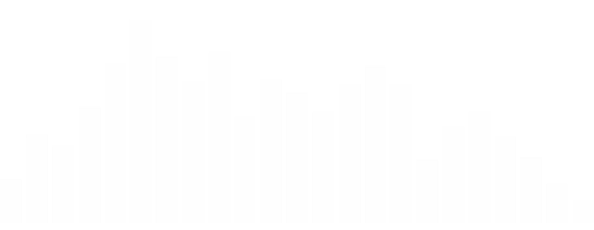

<!-- Main -->

	<!-- One -->
	<section id="one">
		

			<header class="major">
				<h1>Features</h1>
			</header>

			<!-- Content -->
			<h2 id="content">Variants</h2>
			

				

					<h3>Round</h3>
					
				

				

					<h3>Square</h3>
					
				

				

					<h3>Landscape</h3>
					
				

			

			

				

					
The newest of the three, the round variant of PlayMusic has quickly become a favorite of many. Though, given the non-linear base, maintaining the flush alignment of the visualizer to the bottom of the skin can be a challenge while maintaining its scalability.

					<!-- 
Nunc lacinia ante nunc ac lobortis. Interdum adipiscing gravida odio porttitor sem non mi integer non faucibus ornare mi ut ante amet placerat aliquet. Volutpat eu sed ante lacinia sapien lorem accumsan varius montes viverra nibh in adipiscing blandit tempus accumsan.
 -->
				

				

					
Nunc lacinia ante nunc ac lobortis. Interdum adipiscing gravida odio porttitor sem non mi integer non faucibus ornare mi ut ante amet placerat aliquet. Volutpat eu sed ante lacinia sapien lorem accumsan varius montes viverra nibh in adipiscing blandit tempus accumsan.

				

				

					
Nunc lacinia ante nunc ac lobortis. Interdum adipiscing gravida odio porttitor sem non mi integer non faucibus ornare mi ut ante amet placerat aliquet. Volutpat eu sed ante lacinia sapien lorem accumsan varius montes viverra nibh in adipiscing blandit tempus accumsan.

				

			

		

		

		

			

				

					<h2>Visualizer</h2>
					

						
					

					
In response to many users (<i>myself included</i>), using PlayMusic in conjunction with other visualizer skins, PlayMusic now features a highly-customizable, integrated visualizer. These options include customizable accent colors, performance, and scalability, ensuring a perfect addition to any layout.

				

				

					<h2>Volume Control</h2>
					

						
					

					
In order to maximize the accessibility of the skin, volume control has also been seamlessly added to PlayMusic. To utilize this functionality, simply scroll your scroll-wheel up or down while hovering your cursor over the skin, which will also display a visual indication of the volume level.

				

				

					<h2>Visualizer</h2>
					

						
					

					
In response to many users (<i>myself included</i>), using PlayMusic in conjunction with other visualizer skins, PlayMusic now features a highly-customizable, integrated visualizer. These options include customizable accent colors, performance, and scalability, ensuring a perfect addition to any layout.

				

				

					<h2>Volume Control</h2>
					

						
					

					
In order to maximize the accessibility of the skin, volume control has also been seamlessly added to PlayMusic. To utilize this functionality, simply scroll your scroll-wheel up or down while hovering your cursor over the skin, which will also display a visual indication of the volume level.

				

			

		

	</section>

